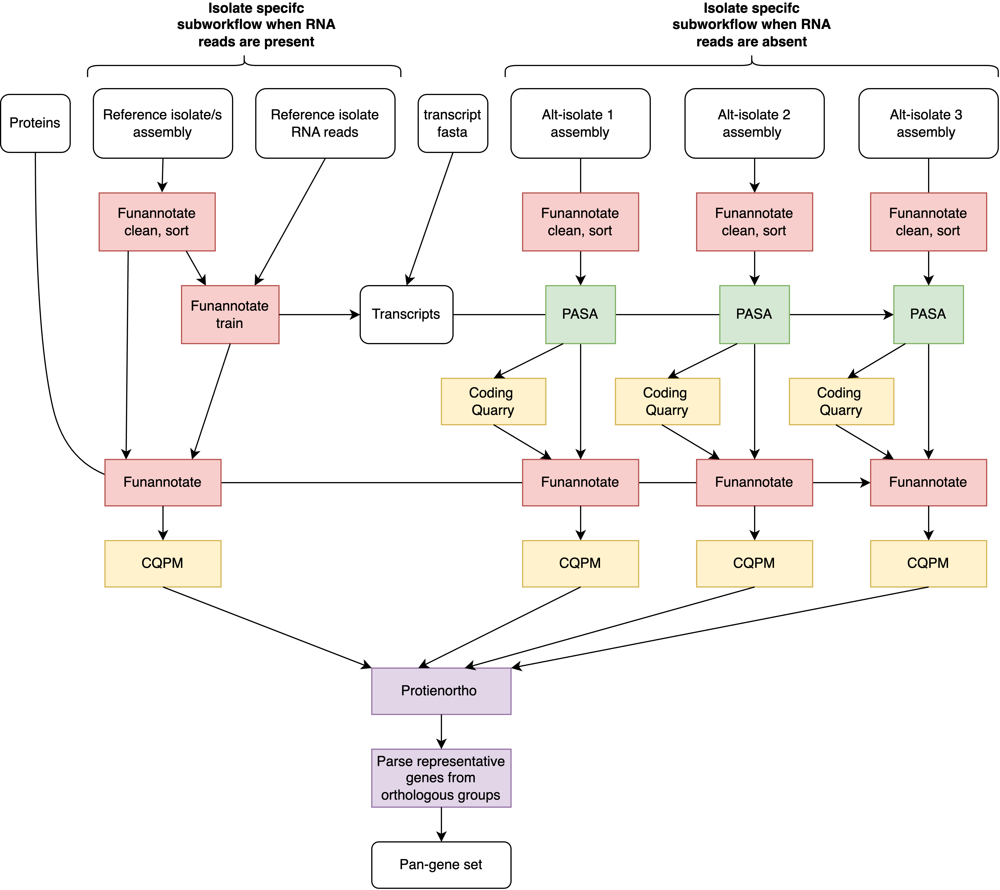

Annotate-pangenome workflow
===================================

**Annotate-pangenome** is a gene annotation workflow which produces
a pan-gene set of representative CDS/protein sequences from multiple isolate genomes. The 
workflow accounts for the possibility that some isolates may have more
available evidence for annotation (here termed 'reference isolates') than others
('alternate isolates'), and is executed dynamically depending on provided inputs.

The prediction of genes is largely powered by ``funannotate`` modules. First, all genome assemblies
are preprocessed with ``funannotate clean`` and ``sort`` modules. Genomes that have corresponding RNA reads
go through ``funannotate train``, which will produce an RNA-bam, PASA gff, and transcript fasta. These are
used to annotate the 'reference isolate' genomes with ``funannotate predict``. For genomes without RNA reads, the transcripts from running ``funannotate train``
on 'reference isolates' will be used (and concatenated with input transcripts if provided) to perform ``PASA`` annotation
on 'alternate isolates'. The produced PASA gff will be used first as input evidence to ``Coding Quarry``, which is not supported in funannotate predict unless an RNA-bam is provided. 
The PASA gff and Coding Quarry annotations will then be used as evidence in ``funannotate predict``. 

Optionally, ``Coding Quarry pathogen mode`` (CQPM) can be run after funannotate predict. This module will mine intergenic regions for effector-like genes that may have been missed by ``funannotate``.

Finally, ``proteinortho self-blast`` is run to cluster predicted proteins into ortho-groups, and custom scripts are used
to extract representative sequences, yeilding a pan-gene set representative of multiple isolate genomes. 

Basic schematic of annotate-pangenome workflow

.. _commands:

Annotate-pangenome Commands
===========================
A description for all Annotate-pangenome commands.

.. code-block:: None

	Usage:	nextflow run MycoProcessor/main.nf --tool annotate-pangenome <arguments>

	Required:
		--genomes           Genome fasta files
		--outputdir         Output directory
		--gmark_db          Path to user installed GeneMark 

	Optional:
		--transcripts       Transcript file/s, multiple files will be concatenated
		--rnareads          RNA reads for reference isolates, must have same basename as corresponding genome
		-profile            Nextflow profile to use for execution
		--funannotate_db    Path for funannotate database (will be installed/used from MycoProcessor directory by default)
		--cqpm              Perform additional annotation with Coding Quarry pathogen mode. Default: False
		--signalp_path      Path for SignalP v4.1 (required if running cqpm)

.. note::
	Genemark must be installed to run this workflow. This is a licensed software which
	may be downloaded from http://topaz.gatech.edu/GeneMark/license_download.cgi. Provide the
	path to Genemark with ``--gmark_db``.

   	If running CQPM, singularity must be enabled, and a path to SignalP v4.1 must be provided.
   	SignalP is a licensed software and may be downloaded from https://services.healthtech.dtu.dk/services/SignalP-4.1/.
   	Following installation, provide the path to the 'signalp-4.1' directory with ``--signalp_path``.

