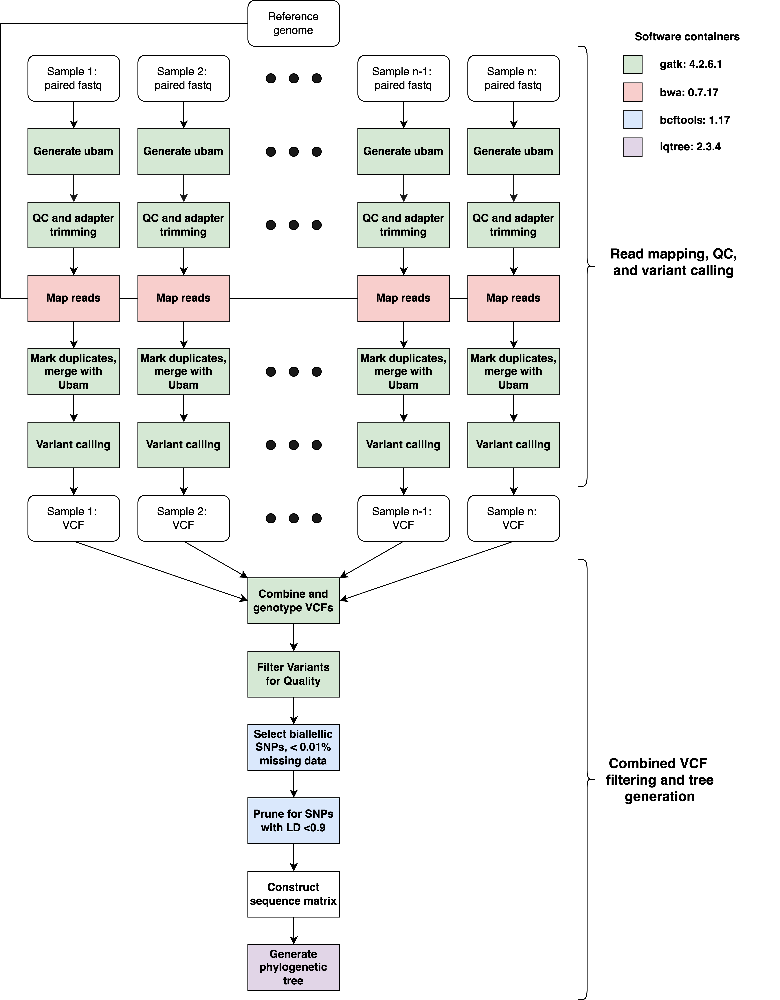

snps-phylo workflow
===================================

**snps-phylo** is a pan-genomics workflow for generating a population phylogeny from
multiple isolate samples, using snps. The inputs are paired-end DNA sequencing reads 
and a reference genome. The workflow will perform read QC, read mapping, mapping QC, variant
calling, and variant QC and filtering to attain a set of SNPs from which a maximum likelihood tree will be built. 

Basic schematic of snps-phylo workflow

snps-phylo Commands
===========================
A description for all snps-phylo commands.

.. code-block:: None

	Usage:	nextflow run MycoProcessor/main.nf --tool snps-phylo <arguments>

    Required:
        --ref               Reference genome
        --fastq             paired end DNA sequencing reads
        --outputdir         Output directory 

    Optional:
        --refname           Prefix to use for output files. Default: "Mycoprocessor"
        --missingdata       Missing data threshold to use for SNP selection. Default: 0.001
        -profile            Nextflow profile to use for execution
